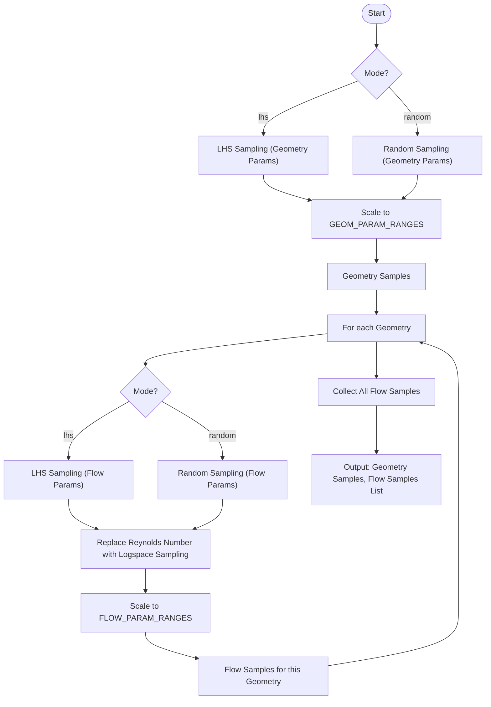

# Doc
- ~Dataset: 2000 samples, have label, with d[2,..,9]


# Data generator
## Usage
### Configure
The generation is controled by `config.py`.
It includes five parts: GEOM_PARAM_RANGES, FLOW_PARAM_RANGES,
SAMPLING, COMPUTATION, OUTPUT.
- GEOM_PARAM_RANGES: Aspect ratio is used to control primary shape of particle,
                     while spherical harmonic method is used to control 
                     particle shape detail.
- FLOW_PARAM_RANGES: Incident angle and Reynolds number.
- SAMPLING: Only two modes for sampling are provided: lhs and random methods.
- COMPUTATION: Higher mesh level means more particle face in geometry. 
### Generate 
```
python3 generate_data.py [-options]
python3 generate_data.py # default. Only generate stl files by Ar and angle
```
Four options:
  - enable-voxel        # this argument to enable voxel generation

  - enable-sdf          # this argument to enable sdf generation

  - disable-Re-cal      # this argument to disable Re number calculation,
                        # it means only generate particle by Ar

  - noise               # this argument to enable gaussain noise to 
                        # particle shape
Ar: aspect ratio
## Sampling methodology
This flowchart describes the sampling process:

